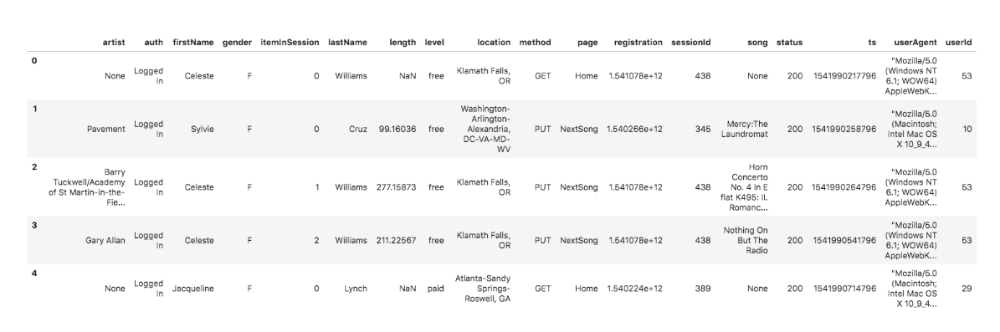

# Introduction

A music streaming startup, Sparkify, has grown their user base and song database even more and want to move their data warehouse to a data lake. Their data resides in S3, in a directory of JSON logs on user activity on the app, as well as a directory with JSON metadata on the songs in their app.

Here our task is to build an ETL pipeline that extracts data from S3, processes them using Spark, and loads the data back into S3 as a set of dimensional tables. This allows analytics team to continue finding insights in what songs their users are listening to.

Here we can test our database and ETL pipeline by running queries given by the analytics team from Sparkify and the obtained results are compared with that of actual results.

# **Dataset Description:**

Here we will be working with two datasets that are already there in S3 bucket.The S3 links for the buckets are as follows:

**Song data:** s3://udacity-dend/song_data

**Log data:** s3://udacity-dend/log_data

**Log data json path:** s3://udacity-dend/log_json_path.json

# **Song Dataset:**

Here the song dataset is a subset of real data from Million Song Dataset.Each file is in JSON format and contains metadata about a song and the artist of that song. The files are partitioned by the first three letters of each song's track ID. 

{"num_songs": 1, 
"artist_id": "ARJIE2Y1187B994AB7", 
"artist_latitude": null,
"artist_longitude": null,
"artist_location": "",
"artist_name": "Line Renaud", 
"song_id": "SOUPIRU12A6D4FA1E1", 
"title": "Der Kleine Dompfaff", 
"duration": 152.92036,
"year": 0}

# **Log Dataset:**

The second dataset consists of log files in JSON format generated by this event simulator based on the songs in the dataset above. These simulate app activity logs from an imaginary music streaming app based on configuration settings. The sample dataframe of the Log Dataset is as follows:

# **Schema for Song Play Analysis:**

Using the song and log datasets, we will be creating a star schema optimized for queries on song play analysis. This includes the following tables.

The fact tables are as follows:

1. **songplays:** This talble holds records in log data associated with song plays i.e. records with page NextSong
   *Columns:* songplay_id, start_time, user_id, level, song_id, artist_id, session_id, location, user_agent.

The Dimension tables are as follows:

1. **Users:** This table gives all the details about the users in the app.
   *Columns:* user_id, first_name, last_name, gender, level.

2. **songs:** This tables gives all the details about the songs in the music database.
   *Columns:* song_id, title, artist_id, year, duration.

3. **artists:** This table gives us all the details about the artists of the songs in the database.
   *Columns:* artist_id, name, location, lattitude, longitude.

4. **time:** This table gives timestamps of records in songplays which are broken down into specific units.
   *Columns:* start_time, hour, day, week, month, year, weekday.

# **Project Template:**

The project consists of three files namely.

1. **etl.py** etl python file reads data from S3 and the read data is processed using Spark and then data is written back to S3.

2. **dl.cfg** df files consists of the configurations with respect to AWS services such as AWS secret key, etc.

3. **readme.md** readme files explains about the process of execution and the schema details.

The data pipeline for the project is as follows:

* Firstly the aws credentials are loaded from dl.cfg and the connection is made to access AWS services.

* Input data is loaded from S3 bucket which is available in JSON format.

* Then the loaded data is processed using Spark dataframe and the above mentioned dimension and fact tables are generated.

* Then the generated dimension and fact tables are loaded back to S3 bucket.

# Important Instructions:

* Make sure correct credentials are included in dl.cfg

* After the terminal is opened, run the correct command for writing etl.py file.

